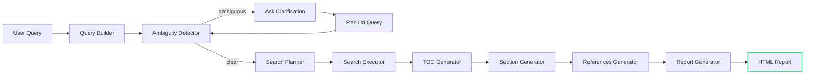
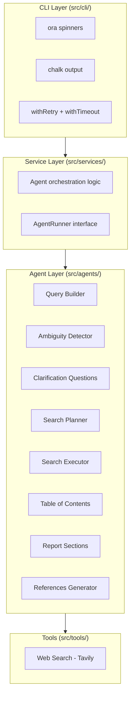
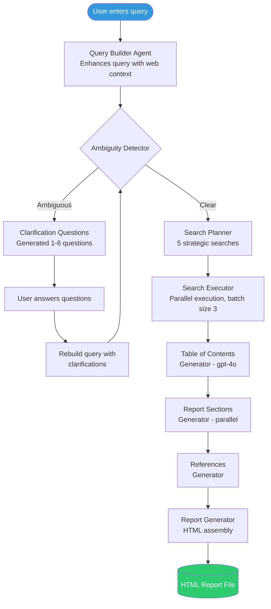

# Deep Research Assistant

An AI-powered CLI tool that transforms vague research queries into professional HTML reports using a multi-agent pipeline.

## Features

- **Ambiguity detection** — identifies 5 types of query ambiguity (scope, temporal, definitional, geographical, purpose)
- **Interactive clarification** — asks targeted questions to refine vague queries (max 2 rounds)
- **Strategic search planning** — generates 5 non-overlapping search strategies
- **Parallel web search** — executes searches concurrently via Tavily with batch concurrency
- **Multi-agent report generation** — TOC, sections, references, and full HTML assembly
- **Provider flexibility** — supports OpenAI and any OpenAI-compatible API (Ollama, LM Studio, etc.)
- **Resilience built-in** — timeouts, retries with jitter, typed error hierarchy, graceful degradation

## Quick start

```bash
npm install -g deep-research-assistant
deep-research
```

On first run, the interactive setup wizard guides you through configuring your LLM and search providers.

## Installation

### Global (recommended)

```bash
npm install -g deep-research-assistant
deep-research --help
```

### From source

```bash
git clone https://github.com/kaushik2901/deep-research-assistant.git
cd deep-research-assistant
npm install
npm run build
npm start
```

## CLI reference

| Flag | Description |
|------|-------------|
| `deep-research` | Run the research pipeline (with auto-setup on first run) |
| `deep-research --setup` | Re-run the interactive configuration wizard |
| `deep-research --help` | Show help message |
| `deep-research --version` | Show version number |

## First run

On first launch the setup wizard asks for:

1. **LLM provider** — `openai` (default) or `openai-compatible` (custom base URL like `http://localhost:1234/v1`)
2. **API key** for your chosen provider
3. **Tavily API key** for web search

Config is saved to `~/.config/deep-research/config.json`. Environment variables (`.env` file) work as a fallback.

## How it works



## Architecture

### Code layers



### Research pipeline detail



### Resilience features

```mermaid
flowchart LR
    subgraph Timeouts["⏱ Timeouts"]
        T1[120s per agent call]
        T2[30s per search call]
    end

    subgraph Retry["🔄 Retry"]
        R1[up to 3 attempts]
        R2[exponential backoff]
        R3[+25% jitter]
        R4[capped at 30s]
    end

    subgraph Degradation["🛡 Graceful degradation"]
        D1[TOC failure → fallback outline]
        D2[References failure → empty list]
        D3[Search failure → partial results]
        D4[File write failure → stdout output]
    end

    subgraph Errors["⚠ Typed errors"]
        E1[AgentError]
        E2[TimeoutError]
        E3[RateLimitError]
        E4[NetworkError]
        E5[SearchError]
    end

    Errors --> Retry
    Retry --> Timeouts
    Timeouts --> Degradation
```



## Agents

| Agent | Model | Output | Purpose |
|-------|-------|--------|---------|
| Query Builder | gpt-4o-mini | string | Enhances query with web context |
| Ambiguity Detector | gpt-4o-mini | `Ambiguity` | Classifies query across 5 ambiguity types |
| Clarification Questions | gpt-4o-mini | `string[]` | Generates 1-6 prioritized questions |
| Search Planner | gpt-4o-mini | `Search[]` | Creates 5 non-overlapping search queries |
| Search Executor | gpt-4o-mini | `string` | Executes one search via Tavily |
| Table of Contents | **gpt-4o** | `TableOfContent` | 4-8 sections with special elements |
| Report Section | gpt-4o-mini | `string` (HTML) | Generates `<section>` HTML content |
| References Generator | gpt-4o-mini | `Reference[]` | Extracts 1-10 references from sources |

## Project structure

```
src/
├── agents/           # 8 OpenAI agent definitions (instructions + Zod schemas)
├── cli/              # CLI wrappers (spinners, chalk, retry, timeouts)
├── services/         # Pure business logic (no I/O, testable)
├── tools/            # External integrations (Tavily web search)
├── types/            # TypeScript interfaces
├── utils/            # Utilities (retry, timeout, batch, config, etc.)
├── templates/        # HTML report template
├── errors/           # Typed error hierarchy
├── run.ts            # Orchestration with dependency injection
└── index.ts          # Entry point (arg parsing, config, setup)
```

## Development

```bash
npm run dev          # Run with ts-node (watch mode)
npm run build        # Compile to dist/
npm test             # Run 60+ unit tests (vitest)
npm run lint         # ESLint check
npm run lint:fix     # Auto-fix lint issues
npm run format       # Prettier format
```

## Output

The generated HTML report is a self-contained file with:

- Professional serif typography and academic styling
- Clickable table of contents with section navigation
- Structured sections with tables, lists, and paragraphs
- Reference list with source URLs
- Print-optimized stylesheet
- Responsive layout

The filename is automatically generated from the report title and timestamp (e.g., `ai-impact-on-jobs-2025-08-25T10-56-05.html`).

## Configuration

Configuration is stored at `~/.config/deep-research/config.json`:

```json
{
  "llm": {
    "provider": "openai",
    "apiKey": "sk-...",
    "baseUrl": "https://api.openai.com/v1"
  },
  "webSearch": {
    "provider": "tavily",
    "apiKey": "tvly-..."
  }
}
```

Environment variables (`.env` file in the project directory) are loaded first, then the config file overrides them.

## License

MIT — see [LICENSE](LICENSE).
